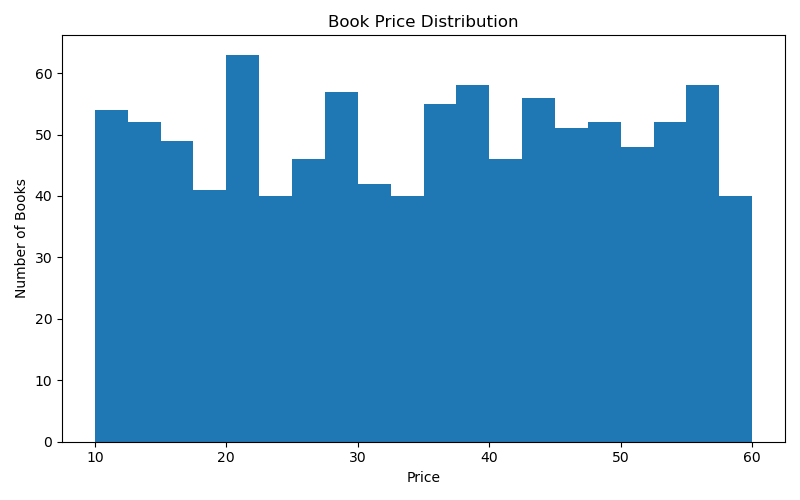
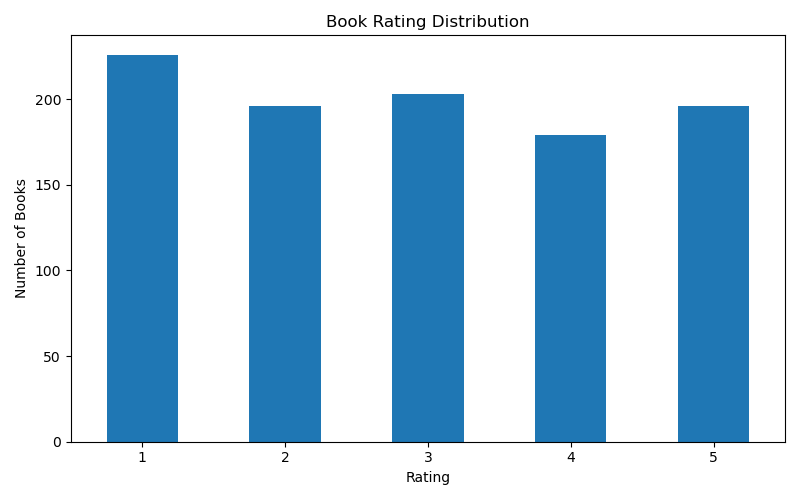
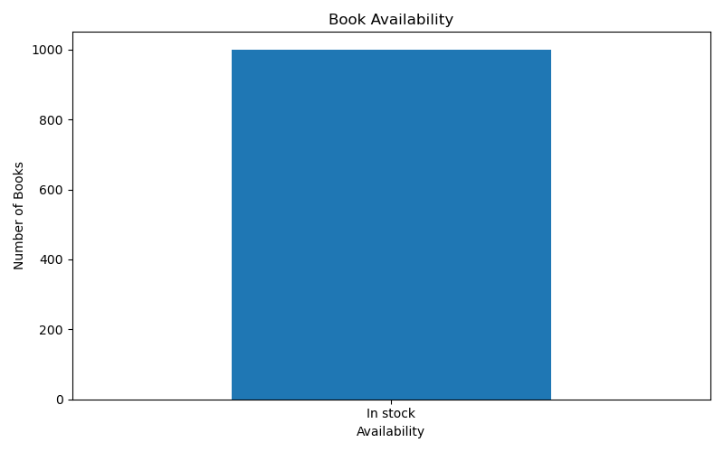

📚 Books Web Scraping & Data Analysis
A Python-based web scraping and data analysis project that collects book information from Books to Scrape, cleans the scraped dataset, and performs basic data analysis and visualization.

🚀 Features
Scrapes 1000 book records from the website
Extracts:
Book Title
Price
Rating
Availability
Book URL
Handles multiple pages automatically
Cleans and removes duplicate/missing data
Converts price and rating into numeric format
Performs basic data analysis
Finds the most expensive books
Creates data visualizations
Saves scraped and cleaned datasets as CSV files
🛠️ Technologies Used
Python
Requests
BeautifulSoup
Pandas
Matplotlib
## 📈 Visualizations

### Book Price Distribution

### Book Rating Distribution

### Book Availability

📂 Project Structure
Books-Web-Scraping/
│
├── scraper.py
├── clean_data.py
├── analysis.py
├── books_dataset.csv
├── cleaned_books_dataset.csv
├── README.md
└── charts/